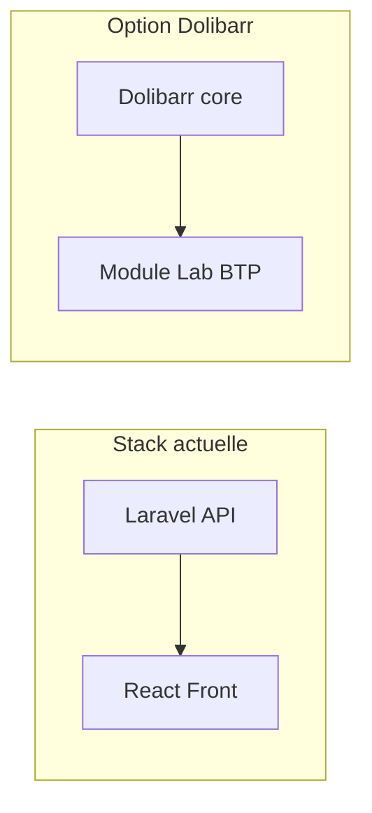

# Module Dolibarr vs plateforme actuelle (s2gBot BTP)

Comparaison entre poursuivre le développement de la plateforme BTP **Laravel + React** actuelle et basculer sur un **module Dolibarr** pour le même métier (essais laboratoire BTP : commandes, échantillons, résultats, rapports, facturation).

## Ce que représente « tout ça » aujourd’hui

La partie **Lab BTP** du dépôt est une application dédiée avec :

- **Backend Laravel 11** : ~17 modèles (clients, sites, types d’essais/paramètres, commandes/lignes, échantillons, résultats, rapports, factures/devis, cadrage S0, mails).
- **Frontend React 18** : écrans rôles (admin, technicien, client), graphiques essais, calculs BTP (fck, MF, SE, CBR, etc.), génération PDF.
- **Fonctionnalités** : auth (Sanctum), rôles (lab_admin, lab_technician, client, site_contact), API REST complète, stats/tableaux de bord.

Donc aujourd’hui : une stack complète (API + SPA + BDD + auth + perms) à maintenir et à déployer.

---

## Ce que Dolibarr apporte « gratuitement »

Dolibarr est un ERP/CRM qui couvre déjà une grande partie du périmètre « commercial + facturation » :

| Besoin actuel (Laravel)     | Équivalent Dolibarr                      |
| --------------------------- | ---------------------------------------- |
| Clients, chantiers/sites    | Tiers (sociétés), projets, contacts      |
| Devis, commandes            | Propals, Commandes fournisseurs/clients  |
| Facturation                 | Factures, paiements                      |
| Utilisateurs et permissions | Utilisateurs, groupes, droits par module |
| Interface back-office       | Menus, listes, fiches, thème             |

Un **module Dolibarr** n’aurait donc à créer que la partie **métier labo** :

- Types d’essais et paramètres (catalogue).
- Lien commande → échantillons → résultats (ou lien avec les commandes Dolibarr).
- Saisie des résultats, calculs normes (fck, MF, etc.).
- Génération des rapports PDF BTP.
- Éventuellement une page « tableau de bord / stats essais ».

Le reste (clients, commandes, factures, users) s’appuie sur le cœur Dolibarr (tables, écrans, droits).

---

## Comparaison synthétique

| Critère                | Garder Laravel + React                                                                  | Module Dolibarr                                                                   |
| ---------------------- | --------------------------------------------------------------------------------------- | --------------------------------------------------------------------------------- |
| **Effort initial**     | Déjà bien avancé ; reste à compléter/industrialiser                                     | Réécrire la logique métier en PHP Dolibarr (classes, triggers, hooks, sql/, lib/) |
| **Réutilisation**      | Aucune ; tout est custom                                                                | Tiers, commandes, factures, users, perms, UI de base                              |
| **Maintenance**        | 2 stacks (PHP + Node/React), 2 déploiements possibles                                   | 1 stack PHP, 1 app (Dolibarr + module)                                            |
| **Liberté**            | Totale (API, UX, technos)                                                               | Contrainte par l’archi et l’UI Dolibarr                                           |
| **Déploiement**        | Laravel + front (Vite) + BDD                                                            | Un serveur Dolibarr (LAMP/LEMP) + module dans `htdocs/custom/`                    |
| **Évolution Dolibarr** | N/A                                                                                     | À suivre les mises à jour Dolibarr (compatibilité module)                         |
| **Multi-usage**        | Possible d’avoir aussi les microservices (api/back/calcul/auth/front) dans le même repo | Dolibarr = surtout ERP/CRM ; le « bot » / microservices restent à part si besoin  |

---

## Quand un module Dolibarr est « plus simple »

- Vous voulez **un seul outil** pour la compta, la facturation, les commandes et le labo.
- L’équipe ou le client est **déjà à l’aise avec Dolibarr** (ou prévoit de l’utiliser comme ERP).
- Vous acceptez de **tout réécrire en PHP** dans le format module (descriptor, classes, triggers, menus, sql, langues).
- Vous n’avez **pas besoin** de garder une SPA React dédiée ni une API découplée pour d’autres apps.

Dans ce cas : oui, **un module Dolibarr peut être plus simple** à long terme (une seule app, une seule stack, moins de pièces à déployer).

---

## Quand garder Laravel + React reste pertinent

- Vous tenez à **garder une API REST découplée** (mobile, intégrations, n8n, etc.).
- Vous voulez une **UX 100 % sur mesure** (React) sans être limité par les écrans Dolibarr.
- Vous **n’utilisez pas (pas encore) Dolibarr** pour la compta / la facturation.
- La partie **microservices** (api, back, calcul, auth) du repo doit continuer à vivre avec la même codebase.

Dans ce cas : continuer sur Laravel + React est cohérent, même si la maintenance est plus lourde.

---

## Recommandation pratique

- **Si l’objectif est « moins de code et une seule app (ERP + labo) »** et que Dolibarr est (ou sera) votre ERP : **opter pour un module Dolibarr** est un bon choix et peut être plus simple une fois le module en place.
- **Si vous avez besoin d’une API ouverte, d’une SPA très spécifique ou que Dolibarr n’est pas dans le paysage** : **rester sur Laravel + React** est plus adapté.

**En résumé** : oui, faire un module Dolibarr peut être **plus simple** en termes de nombre de briques et de maintenance, à condition d’accepter de tout porter en PHP dans l’écosystème Dolibarr et de ne pas s’appuyer sur l’API/React actuelles. Sinon, garder l’app actuelle reste la voie la plus simple.

---

## Références utiles (Dolibarr)

- [Documentation développeur — Wiki Dolibarr](https://wiki.dolibarr.org/index.php/Developer_documentation)
- [Développement de module — Wiki (FR)](https://wiki.dolibarr.org/index.php/D%C3%A9veloppement_module)
